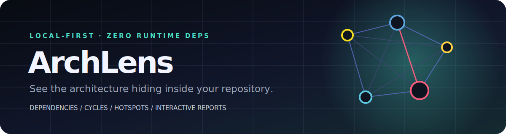
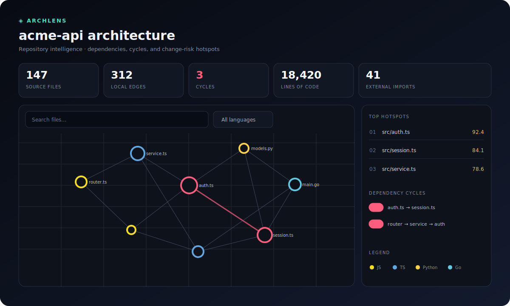
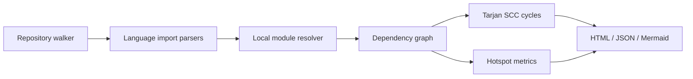

<div align="center">
  
</div>

<div align="center">
  <a href="https://github.com/mockingbird777/archlens/actions/workflows/ci.yml"></a>
  <a href="LICENSE"></a>
  
  
</div>

**ArchLens turns a source tree into an architecture map you can actually use.** One command finds local dependencies, circular dependency groups, and change-risk hotspots across JavaScript, TypeScript, Python, and Go—then produces a private, self-contained interactive report.

No account. No upload. No background service. No runtime dependencies.

<p align="center"><a href="https://mockingbird777.github.io/archlens/"><strong>Explore the live interactive report →</strong></a></p>

<div align="center">
  
</div>

## Quick start

Requires [Node.js 20 or newer](https://nodejs.org/).

```bash
# Run the latest code directly from GitHub (the package is not on npm yet)
npx --yes github:mockingbird777/archlens .

# Open the generated report
open archlens-report.html       # macOS
xdg-open archlens-report.html  # Linux
```

Or install the GitHub repository globally:

```bash
npm install --global github:mockingbird777/archlens
archlens ./your-repository
```

The install runs the repository's `prepare` script to compile TypeScript before the CLI starts. npm registry commands such as `npx archlens` are intentionally not documented until a package is published there.

## Why ArchLens?

Dependency graphs are often either too shallow to guide a refactor or locked behind a hosted platform. ArchLens aims for the useful middle: a fast, auditable local CLI with enough repository intelligence for code review, onboarding, and architectural cleanup.

- **Find cycles before they harden.** Tarjan's strongly connected components algorithm identifies complete circular dependency groups, including self-loops.
- **Prioritize risky files.** A transparent hotspot score combines unique fan-in, unique fan-out, file size, and cycle membership.
- **Understand polyglot repositories.** Analyze JS/TS ESM, CommonJS, Python imports, and local Go module imports in one pass.
- **Share a report, not your source.** The HTML report contains graph metadata only and makes no network requests.
- **Automate architecture checks.** Stable JSON and Mermaid output are easy to consume in CI, pull requests, or docs.
- **Trust the toolchain.** ArchLens itself ships with zero runtime dependencies and uses only Node.js built-ins.

## What it produces

### Interactive HTML

The default report is a single portable file with:

- live file search and language filters;
- cycle-only and hotspot-only focus modes;
- zoomable and pannable dependency graph;
- clickable node details with LOC, fan-in, fan-out, and cycle membership;
- hotspot ranking, cycle summaries, and an embedded machine-readable dataset;
- responsive layout and no CDN, analytics, fonts, or remote assets.

```bash
npx --yes github:mockingbird777/archlens . --title "Payments service architecture"
```

### JSON

Use the versioned schema for scripts and CI:

```bash
npx --yes github:mockingbird777/archlens . --format json --stdout > architecture.json
```

The document includes `meta`, `summary`, `nodes`, `edges`, `unresolvedImports`, `cycles`, `hotspots`, and non-fatal `warnings`. Paths are repository-relative; source contents and absolute paths are never emitted.

### Mermaid

Keep a graph next to your technical documentation:

```bash
npx --yes github:mockingbird777/archlens ./packages/core --format mermaid --output docs/core-graph.mmd
```

## CLI reference

```text
archlens [path] [options]

-f, --format <type>    html (default), json, or mermaid
-o, --output <file>    Output path; use - for stdout
    --stdout           Write the report to stdout
    --include <glob>   Only scan matching files (repeatable)
    --exclude <glob>   Ignore matching paths (repeatable)
    --no-gitignore     Do not read .gitignore files
    --max-files <n>    Safety limit (default: 20000)
    --title <text>     Custom HTML report title
-q, --quiet            Suppress progress and summary
-h, --help             Show help
-v, --version          Show the version
```

Examples:

```bash
npx --yes github:mockingbird777/archlens . --exclude '**/*.test.ts' --exclude 'generated/**'
npx --yes github:mockingbird777/archlens . --include 'packages/**' --max-files 50000
npx --yes github:mockingbird777/archlens services/api -f json -o artifacts/api-architecture.json
```

ArchLens always skips common generated or heavyweight directories such as `.git`, `node_modules`, `dist`, `build`, `coverage`, `vendor`, virtual environments, and language caches. It also evaluates common `.gitignore` rules, including wildcards, anchored paths, directory rules, and negation.

## Language support

| Language | Recognized syntax | Local resolution |
| --- | --- | --- |
| JavaScript / TypeScript | `import`, side-effect import, re-export, dynamic `import()`, `require()` | relative files, extensionless files, directory indexes, TS source behind `.js` specifiers |
| Python | `import`, aliased/multiple imports, `from … import`, relative imports | module files and package `__init__.py` from the source directory or repository root |
| Go | single, grouped, aliased, blank, and dot imports | packages under the module path declared by `go.mod`, plus relative imports |

External packages are counted but deliberately excluded from the local file graph. Imports that look local but cannot be resolved are reported separately so configuration gaps remain visible.

## How it works



The implementation is intentionally layered:

```text
src/
├── analyzers/   # Dependency extraction per language
├── core/        # Walking, ignores, resolution, SCC, metrics
├── reporters/   # Self-contained HTML, JSON, Mermaid
├── test/        # node:test unit and integration tests
├── cli.ts       # Argument parsing and terminal UX
└── index.ts     # Public programmatic API
```

Install from GitHub, then use it as a library:

```bash
npm install github:mockingbird777/archlens
```

```ts
import { analyzeRepository } from 'archlens';

const result = await analyzeRepository({
  root: './my-repo',
  exclude: ['generated/**'],
});

console.log(result.cycles);
```

## Hotspot score

Scores are relative to the scanned repository and range from 0 to 100:

```text
40% normalized fan-in
25% normalized fan-out
25% normalized LOC
10% circular-dependency membership
```

Log normalization keeps one generated mega-file from flattening every other signal. The score is a prioritization aid—not a claim about code quality.

## Privacy and security

ArchLens runs entirely on your machine. It does not make network calls, execute scanned code, evaluate configuration files, or include source text in reports. Reports contain relative file paths and import specifiers, which can still be sensitive; review them before sharing outside your organization.

See [SECURITY.md](SECURITY.md) for responsible disclosure and the threat model.

## Current boundaries

ArchLens favors predictable zero-configuration analysis over compiler-level completeness. It does not yet evaluate TypeScript path aliases, bundler aliases, Python environment/package metadata, Go workspaces, conditional imports, or computed import strings. Parser false positives and unresolved edges are possible in syntactically unusual code. Please open a small reproduction when you find one.

## Roadmap

- [ ] `tsconfig.json` and package `exports` resolution
- [ ] configurable architecture boundaries and CI exit policies
- [ ] graph diffing between commits
- [ ] ownership and churn overlays from local Git history
- [ ] Rust and Java/Kotlin analyzers
- [ ] plugin API for organization-specific resolvers

## Contributing

Issues and pull requests are welcome. Start with [CONTRIBUTING.md](CONTRIBUTING.md), follow the [Code of Conduct](CODE_OF_CONDUCT.md), and run `npm test` before submitting a change. Good first contributions include focused parser fixtures, resolver edge cases, report accessibility, and performance profiles from large public repositories.

## License

[MIT](LICENSE) © 2026 ArchLens contributors.
